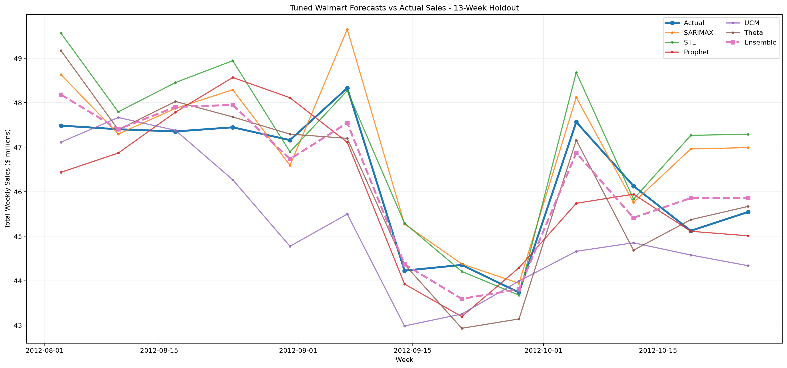

# Walmart Weekly Sales Forecasting

An end-to-end Walmart-wide weekly sales forecasting project using statistical time-series models, expanding-window cross-validation, and an equal-weight ensemble.

## Start here

The full setup instructions, notebook walkthrough, validation design, and methodology are in [project_files/README.md](project_files/README.md).

## Repository layout

```text
.
├── project_files/       # Runnable notebook, scripts, input data, and detailed README
├── results/             # Published forecast tables, model-selection files, and charts
├── requirements.txt      # Supported dependency ranges
└── requirements-lock.txt # Exact verified dependency versions
```

To run the project after cloning:

```powershell
cd project_files
python -m venv .venv
.\.venv\Scripts\python.exe -m pip install -r requirements.txt
.\.venv\Scripts\python.exe run_notebook.py
```

`requirements.txt` lists compatible version ranges for a normal installation. `requirements-lock.txt` pins the exact package versions from the verified environment; use it when you want the closest possible reproduction.

## Result preview



The published output files are in [results](results). The equal-weight ensemble achieved the best historical 13-week holdout RMSE: **$560,019**.
