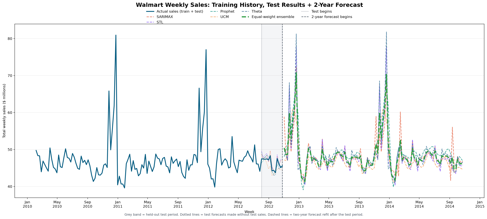

# Walmart Multi-Model Time-Series Forecasting

An end-to-end forecasting project that predicts Walmart-wide weekly sales using five statistical models and an equal-weight ensemble. It pairs a beginner-friendly Jupyter notebook with reusable Python scripts for tuning, testing, and planning forecasts.

## Highlights

- Aggregates sales from 45 stores into one continuous Friday-based weekly series.
- Holds out the final 13 weeks for a fair historical test.
- Uses expanding-window cross-validation for tuning; it never randomly shuffles dates.
- Compares SARIMAX, STL + Exponential Smoothing, Prophet, an Unobserved Components Model (UCM), Theta, and an equal-weight ensemble.
- Generates a planning forecast for the following 104 weeks.

## Results

The equal-weight ensemble had the best 13-week holdout RMSE: **$560,019**. This is a historical backtest result, not a guarantee of future performance.

| Model | Holdout RMSE | Holdout MAE | Holdout MAPE |
| --- | ---: | ---: | ---: |
| Equal-weight ensemble | $560,019 | $492,268 | 1.06% |
| Theta | $848,958 | $634,690 | 1.37% |
| Prophet | $904,260 | $760,410 | 1.63% |
| SARIMAX | $937,892 | $768,745 | 1.66% |
| STL + Exponential Smoothing | $1,181,221 | $920,090 | 1.99% |
| UCM | $1,518,291 | $1,199,726 | 2.57% |

### Holdout forecast comparison

This chart overlays actual sales, every tuned model, and the ensemble for the final 13 observed weeks.


### Two-year planning view

The grey band is the historical test period. Dotted lines are predictions made without seeing its sales; dashed lines are the subsequent planning forecasts refit on all observed history.



See [walmart_2_year_forecasts.csv](../results/walmart_2_year_forecasts.csv) and [walmart_2_year_forecast_summary.csv](../results/walmart_2_year_forecast_summary.csv) for the underlying planning values.

## Repository layout

```text
.
├── Dataset/
│   └── Walmart.csv                                # Input store-week observations
├── .vscode/
│   └── settings.json                              # Selects the project Python environment
├── Walmart_Multi_Model_Time_Series_Forecasting.ipynb # Guided analysis and modelling
├── forecast_tuning.py                             # Reusable fitting and CV utilities
├── two_year_forecast.py                           # 104-week planning forecast
├── run_notebook.py                                # Runs and saves notebook outputs
├── test_forecast_tuning.py                        # Chronological split/tuning tests
├── requirements.txt                               # Supported dependency ranges
├── requirements-lock.txt                          # Exact verified versions
├── walmart_*.csv / walmart_*.json                 # Published forecast results
└── walmart_*.png                                  # Published charts
```

## Dataset

`Dataset/Walmart.csv` contains weekly store-level data:

| Column | Meaning |
| --- | --- |
| `Store` | Store identifier |
| `Date` | Week-ending date, parsed as day-month-year |
| `Weekly_Sales` | Weekly sales at the store |
| `Holiday_Flag` | Whether the source designates the week as a holiday week |
| `Temperature`, `Fuel_Price`, `CPI`, `Unemployment` | Other store-week fields provided in the source data |

The notebook sums `Weekly_Sales` by date and takes the maximum `Holiday_Flag` over stores. It forecasts Walmart-wide weekly sales, rather than store-specific sales. Before publishing, confirm you may redistribute the CSV and add its original source and licence here if required.

## Installation

The project was verified with **Python 3.12** on Windows.

### 1. Clone the repository

```powershell
git clone https://github.com/YOUR-USERNAME/walmart_weekly_sales_forecasting.git
cd walmart_weekly_sales_forecasting
cd project_files
```

### 2. Create the environment

```powershell
python -m venv .venv
.\.venv\Scripts\python.exe -m pip install --upgrade pip
.\.venv\Scripts\python.exe -m pip install -r requirements.txt
```

For exact versions from the verified environment, replace the last command with:

```powershell
.\.venv\Scripts\python.exe -m pip install -r requirements-lock.txt
```

### 3. Register the notebook kernel

```powershell
.\.venv\Scripts\python.exe -m ipykernel install --sys-prefix --name walmart-forecasting --display-name "Python (Walmart Forecasting)"
```

## Run the notebook

Open `Walmart_Multi_Model_Time_Series_Forecasting.ipynb` in VS Code or JupyterLab. Select the `.venv` interpreter or **Python (Walmart Forecasting)** kernel, then run all cells from top to bottom.

```powershell
# Launch JupyterLab
.\.venv\Scripts\python.exe -m jupyterlab Walmart_Multi_Model_Time_Series_Forecasting.ipynb

# Or execute every cell non-interactively and save its outputs
.\.venv\Scripts\python.exe run_notebook.py
```

Keep the input file at `Dataset/Walmart.csv` unless you also change the notebook's data-loading path.

## Notebook guide

| Section | What it does |
| --- | --- |
| Environment and configuration | Imports packages, fixes the seed, and explains why time order must be preserved. |
| Data preparation | Loads the CSV, parses dates, checks the data, and creates a continuous Friday series. |
| Exploratory analysis | Plots history and rolling averages, performs STL decomposition, and runs an ADF stationarity check. |
| Evaluation setup | Reserves the final 13 weeks and defines MAE, RMSE, MAPE, and sMAPE. |
| Hyperparameter tuning | Uses two expanding 13-week validation folds. Every candidate must succeed on every fold; mean fold RMSE picks its parameters. |
| Model fitting | Fits SARIMAX, STL, Prophet, UCM, and Theta with selected parameters. |
| Ensemble and reporting | Forms the equal-weight average, compares models on the holdout, and saves tables/charts. |

### Validation workflow

Random train/test splitting would expose future patterns during model development. Instead:

1. The final 13 weeks are reserved as a test set.
2. The preceding 130 weeks are model-development data.
3. Expanding validation folds train on 104 and 117 weeks, respectively, with a 13-week validation horizon after each training period.
4. Each selected model is refit on all 130 development weeks before it predicts the final holdout.

The final test data selects no individual model parameters. Optional subset-ensemble graphics are exploratory and should not be treated as independent model-selection evidence.

## Generate the two-year forecast

Once the notebook has created `walmart_best_params.json`, run:

```powershell
.\.venv\Scripts\python.exe two_year_forecast.py
```

To choose another forecast length or holdout size:

```powershell
.\.venv\Scripts\python.exe two_year_forecast.py --horizon-weeks 52 --test-weeks 8
```

The script first creates fair predictions for the historical holdout using training data only. It then refits on all observed history for planning. Future `Holiday_Flag` values are calendar assumptions: the second Friday in February, the Friday after US Labor Day, Black Friday, and the final Friday in December.

## Outputs

The published snapshot of these outputs is stored in the parent repository's `results/` folder. When you rerun the notebook or planning script, newly generated files are written in `project_files/`; copy the outputs you want to publish into `results/` before committing.

| File | Purpose |
| --- | --- |
| `walmart_model_metrics.csv` | Final holdout MAE, RMSE, MAPE, and sMAPE for all models. |
| `walmart_best_params.json` | CV-selected parameter set for every standalone model. |
| `walmart_cv_results.csv` | Mean and standard deviation of RMSE for all candidates. |
| `walmart_cv_fold_scores.csv` | Per-fold scores and failure details. |
| `walmart_cv_folds.csv` | Training and validation boundaries. |
| `walmart_cv_predictions.csv` | Validation actuals and selected-model predictions. |
| `walmart_3_month_forecasts.csv` | Final 13-week holdout predictions. |
| `walmart_13_week_test_forecasts.csv` | Holdout predictions from the planning script. |
| `walmart_2_year_forecasts.csv` | Future forecast values. |
| `walmart_2_year_forecast_summary.csv` | Holdout RMSE and planning-horizon summaries. |
| `walmart_*.png` | Holdout and planning forecast charts. |

## Tests

```powershell
.\.venv\Scripts\python.exe -m unittest test_forecast_tuning.py
```

## Reproducibility and limitations

- A random seed of 42 is used where applicable.
- The dataset ends in October 2012, so the available history is limited.
- These are Walmart-wide aggregate forecasts; individual-store results could differ.
- Future holiday indicators are assumptions; the models do not know future sales or economic conditions.
- Cross-validation chooses hyperparameters, while the final holdout provides the reported comparison.

## Publishing checklist

- Include source code, the notebook, dependency files, tests, permitted input data, and the small results/charts.
- Do not commit virtual environments, checkpoints, caches, local runtime files, secrets, or operating-system metadata; the provided `.gitignore` excludes them.
- Add a `LICENSE` after choosing one (MIT is a common permissive option), and add data attribution/licensing before publishing the dataset.
